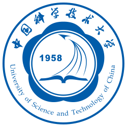

## 👋 Biography

Hello! I am a master's student in Artificial Intelligence at the **School of Artificial Intelligence and Data Science**, **University of Science and Technology of China (USTC)**, advised by [Prof. Zhicheng Zhong](https://saids.ustc.edu.cn/2024/0530/c36361a642532/page.htm).

My research interests focus on **AI for Science** and **AI Agents**, with particular interests in AI for materials and scientific agents.

Before that, I received my B.Eng. degree in Software Engineering from **Shandong University** in 2025, where I worked with [Prof. Leyi Wei](https://wei-group.net/) on deep learning methods for bioinformatics.

---

## 🏫 Affiliation

<table>
<tr>
<td style="width:100px; text-align:center; vertical-align:middle;">

</td>
<td>
<b>Master's Student in Artificial Intelligence</b> 
School of Artificial Intelligence and Data Science 
University of Science and Technology of China, Hefei, China 
 
<b>Advisor:</b> <a href="https://saids.ustc.edu.cn/2024/0530/c36361a642532/page.htm">Prof. Zhicheng Zhong</a>
</td>
</tr>
</table>

---

## 🎓 Education

<table>
<tr>
<td style="width:100px; text-align:center; vertical-align:middle;">

</td>
<td>
<b>University of Science and Technology of China, China</b> 
M.Eng. Student in Artificial Intelligence 
Sep. 2025 - Present
</td>
</tr>

<tr>
<td style="width:100px; text-align:center; vertical-align:middle;">

</td>
<td>
<b>Shandong University, China</b> 
B.Eng. in Software Engineering 
Sep. 2021 - Jun. 2025
</td>
</tr>
</table>

---



---

## 🏆 Honors & Awards

  

    [11/2025]
    Gold Award, AI for Science Track, Intelligent Experiment Category, 2nd Global Digital and Intelligent Education Innovation Competition.
  

  

    [12/2024]
    President's Award, Shandong University — the university's highest student honor.
  

  

    [2022-2024]
    National Scholarship, Ministry of Education of China — awarded for three consecutive years.
  

  

    [07/2024]
    19th National University Students Intelligent Car Race — Smart Inspection Category, National First Prize.
  

  

    [05/2024]
    Outstanding Student of Shandong Higher Education Institutions.
  

---

© Ronglin Lu
